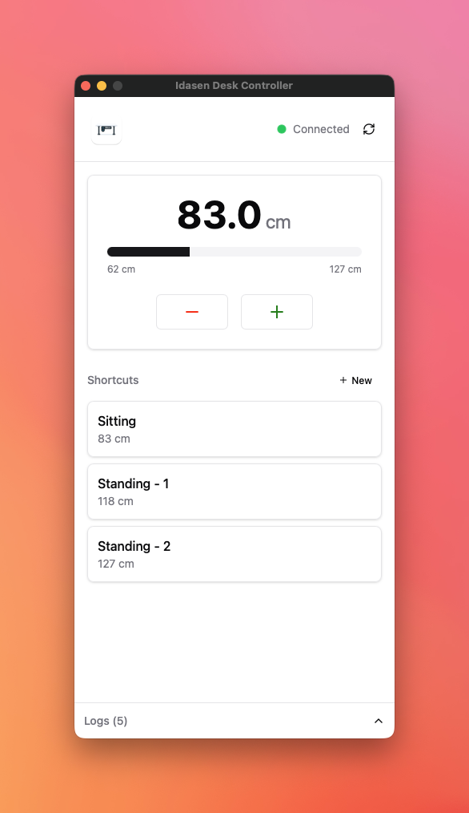
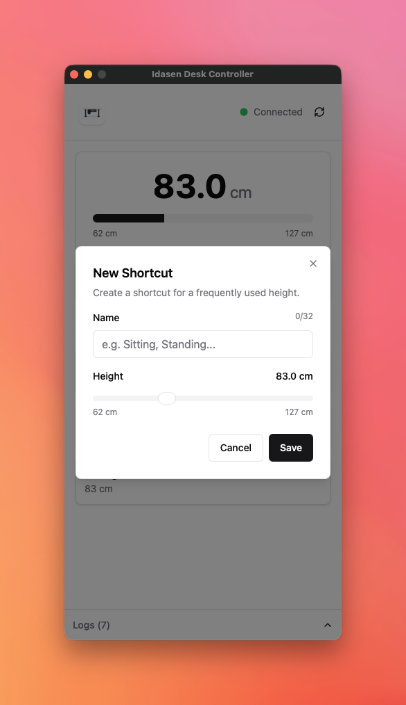
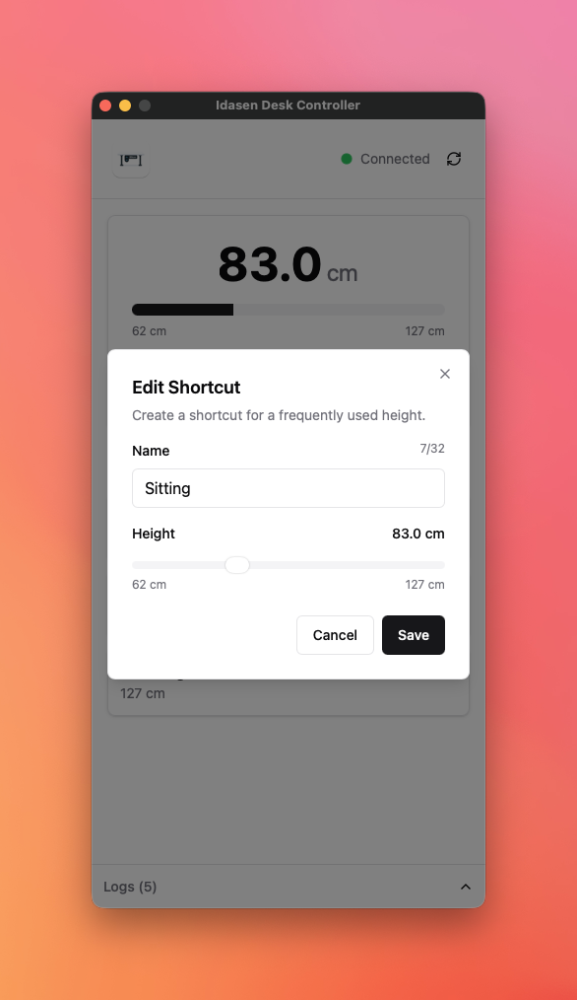

<p align="center">
  
</p>

<h1 align="center">Idasen Desk Controller</h1>

<p align="center">
  <strong>A native macOS app to control your IKEA IDASEN standing desk via Bluetooth</strong>
</p>

<p align="center">
  <a href="#features">Features</a> •
  <a href="#screenshots">Screenshots</a> •
  <a href="#supported-desks">Supported Desks</a> •
  <a href="#installation">Installation</a> •
  <a href="#usage">Usage</a> •
  <a href="#development">Development</a> •
  <a href="#roadmap">Roadmap</a> •
  <a href="#license">License</a>
</p>

---

## Features

- **Real-time Height Display** — Shows current desk height in centimeters with a visual progress bar
- **Manual Controls** — Move up/down in 1cm increments
- **Shortcuts** — Save frequently used heights (e.g., "Sitting", "Standing") for one-click access
- **Auto-Connect** — Automatically connects to your desk on startup
- **Live Updates** — Height updates in real-time while the desk is moving
- **Activity Log** — Expandable log panel for troubleshooting

## Screenshots

<p align="center">
  
</p>
<p align="center"><em>Main view with height display and shortcuts</em></p>

<p align="center">
  
  
</p>
<p align="center"><em>Create and edit shortcuts</em></p>

<p align="center">
  
</p>
<p align="center"><em>Activity log for troubleshooting</em></p>

## Supported Desks

This app works with desks using the **LINAK Bluetooth protocol**:

| Manufacturer | Model                          | Status   |
| ------------ | ------------------------------ | -------- |
| **IKEA**     | [IDASEN](https://www.ikea.com/de/de/p/idasen-schreibtisch-sitz-steh-braun-dunkelgrau-s39281004/) | Tested   |
| **IKEA**     | BEKANT (with Bluetooth module) | Untested |
| **Linak**    | Desk Panel (DPG1C)             | Untested |
| **Linak**    | Other DPG protocol desks       | Untested |

> **Note:** The app searches for Bluetooth devices with the name prefix "Desk". Other Linak-based desks should work but haven't been tested.

> **Disclaimer:** This is an unofficial, community-developed app and is not affiliated with or endorsed by IKEA or LINAK.

### Technical Specs

- **Connection:** Bluetooth Low Energy (BLE)
- **Height Range:** 62 cm – 127 cm
- **Bluetooth UUIDs:**
  - Move Command: `99fa0002-338a-1024-8a49-009c0215f78a`
  - Height Status: `99fa0021-338a-1024-8a49-009c0215f78a`
  - Reference Input: `99fa0031-338a-1024-8a49-009c0215f78a`

## Installation

### Download

Download the latest release from the [Releases](https://github.com/mehmetmuejde/idasen-desk-controller/releases) page.

**Important:** The app is not signed with an Apple Developer certificate. After downloading:

1. Unzip and drag the app to your Applications folder
2. Open Terminal and run:
   ```bash
   xattr -cr "/Applications/Idasen Desk Controller.app"
   ```
3. Now you can open the app normally

> **Note:** Without running the `xattr` command, macOS may show "app is damaged" (Apple Silicon) or block the app (Intel). This is normal for unsigned apps.

### Build from Source

#### Prerequisites

- Go 1.23+
- Node.js 20+
- Wails CLI v2.11+

```bash
# Install Wails CLI
go install github.com/wailsapp/wails/v2/cmd/wails@latest
```

#### Build

```bash
# Clone the repository
git clone https://github.com/mehmetmuejde/idasen-desk-controller.git
cd idasen-desk-controller

# Development mode
wails dev

# Production build
wails build
```

### macOS Permissions

The app requires Bluetooth permissions. On first launch, macOS will prompt you to grant access.

## Usage

1. **Launch** the app
2. **Connect** — The app automatically scans and connects to your desk
3. **Control** your desk:
   - Use **+/−** buttons to move in 1cm steps
   - Click a **Shortcut** to move to a saved height
   - Click **+ New** to create a new shortcut
4. **View Logs** — Click the log panel at the bottom to expand

### Shortcuts

Shortcuts allow you to save frequently used heights:

- Click **+ New** to create a shortcut
- Enter a name (e.g., "Sitting", "Standing")
- Use the slider to set the target height
- Click **Save**

To edit or delete a shortcut, hover over it to reveal the edit and delete buttons.

## Development

### Tech Stack

| Layer             | Technology                           |
| ----------------- | ------------------------------------ |
| Backend           | Go with TinyGo Bluetooth             |
| Frontend          | React 19, TypeScript, TailwindCSS v4 |
| UI Components     | shadcn/ui                            |
| Desktop Framework | Wails v2.11                          |

### Project Structure

```
idasen-desk-controller/
├── app.go                # Go backend (Bluetooth communication)
├── main.go               # Wails entry point
├── frontend/
│   ├── src/
│   │   ├── App.tsx       # Main React component
│   │   ├── components/   # UI components
│   │   │   ├── ui/       # shadcn/ui base components
│   │   │   ├── Header.tsx
│   │   │   ├── HeightDisplay.tsx
│   │   │   ├── ShortcutList.tsx
│   │   │   ├── ShortcutCard.tsx
│   │   │   ├── ShortcutDialog.tsx
│   │   │   └── LogPanel.tsx
│   │   ├── hooks/        # Custom React hooks
│   │   │   ├── useDesk.ts
│   │   │   ├── useShortcuts.ts
│   │   │   └── useLogs.ts
│   │   └── types/        # TypeScript type definitions
│   └── ...
├── build/                # Build configuration
├── icons/                # App icons
└── .github/workflows/    # GitHub Actions (CI/CD)
```

### Running in Development

```bash
wails dev
```

This starts the app in development mode with hot-reload for the frontend.

## Roadmap

Planned features for future releases:

- [ ] **Stop button** — Immediately stop desk movement
- [ ] **Windows support** — Add Windows compatibility
- [ ] **Linux support** — Add Linux compatibility
- [ ] **Multi-language** — German, English, and more
- [ ] **System tray** — Run in background with tray menu
- [ ] **Keyboard shortcuts** — Global hotkeys for quick access
- [ ] **Auto-update** — Built-in update functionality
- [ ] **Standing reminders** — Notifications to switch positions
- [ ] **Usage statistics** — Track sitting/standing time
- [ ] **Mobile app** — iOS and Android companion app

## Contributing

Contributions are welcome! Please feel free to submit a Pull Request.

## License

This project is licensed under the MIT License — see the [LICENSE](LICENSE) file for details.

## Author

**Mehmet Muejde**
[freelancer@mehmetmuejde.com](mailto:freelancer@mehmetmuejde.com)

---

<p align="center">
  Made with Go, React, and Wails
</p>
